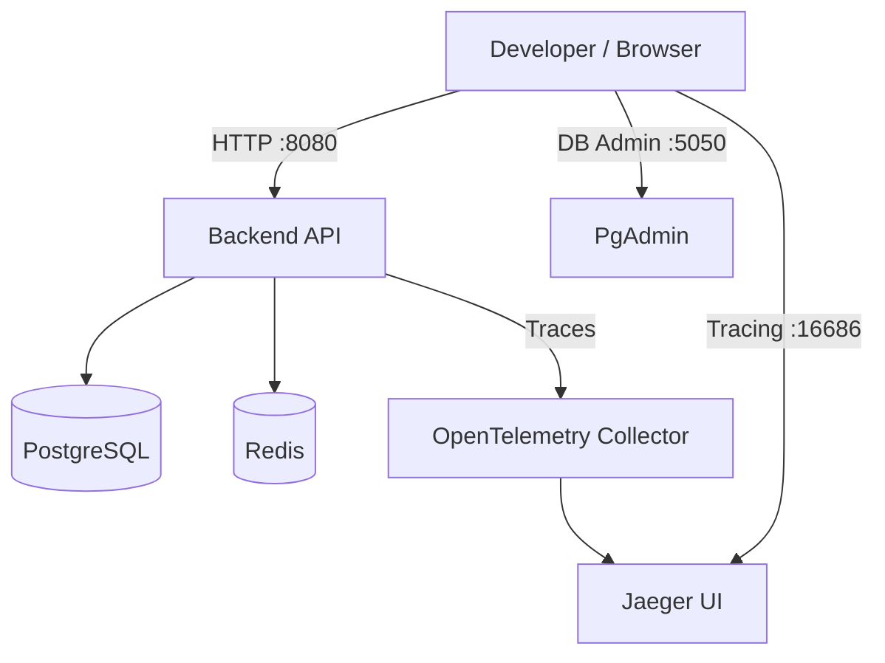

# Readme

---

## Local Services & Access

This project runs multiple services using **Docker Compose** to fully replicate the local development environment. All services are started using:

```bash
mise run start
```

---

### Backend API

**Service:** `backend`
**Description:**
Main application backend. Handles API requests and communicates with PostgreSQL, Redis, and OpenTelemetry.

**Access:**

* **API Base URL:**
  👉 `http://localhost:8000`

**Notes:**

* Source code is mounted into the container for live development
* Environment variables are loaded from:

```text
.envs/.local/.backend
```

---

### PostgreSQL

**Service:** `postgres`
**Description:**
Primary relational database used by the backend.

**Access:**

* **Host:** `localhost`
* **Port:** `5432`
* **Database / User / Password:**
  Defined in:

```text
.envs/.local/.postgres
```

**Persistence:**

* Data is stored in a named Docker volume:

```text
sample_local_postgres_data
```

---

### PgAdmin

**Service:** `pgadmin`
**Description:**
Web-based PostgreSQL administration UI.

**Access:**

* **URL:**
  👉 `http://localhost:5050`

**Login credentials:**

* Defined in:

```text
.envs/.local/.pgadmin
```

**Notes:**

* Use this service to inspect schemas, tables, and run SQL queries
* Depends on the `postgres` service

---

### Redis

**Service:** `redis`
**Description:**
In-memory data store used for caching, background jobs, or ephemeral data.

**Access:**

* **Host:** `localhost`
* **Port:** default Redis port (`6379`) inside the Docker network

**Persistence:**

* Redis data is persisted in:

```text
sample_local_redis_data
```

---

### Jaeger (Distributed Tracing)

**Service:** `jaeger`
**Description:**
UI for inspecting distributed traces collected via OpenTelemetry.

**Access:**

* **Jaeger UI:**
  👉 `http://localhost:16686`

**Usage:**

* View request traces, spans, and performance metrics
* Useful for debugging latency and service interactions

---

### OpenTelemetry Collector

**Service:** `otel-collector`
**Description:**
Receives telemetry data from the backend and forwards it to Jaeger.

**Access:**

* Internal service (not exposed publicly)
* Configuration located at:

```text
/etc/otel-collector-config.yaml
```

---

## Service Dependency Overview

```text
backend
 ├── postgres
 ├── redis
 └── otel-collector
        └── jaeger
```

---

## Volumes

All data is persisted using Docker volumes to survive container restarts:

* PostgreSQL data
* Redis data
* PgAdmin metadata
* Application logs

---

If you want, I can also:

* Add a **Service Access Table** (URL / Port / Purpose)
* Add **health check commands**
* Add **reset / cleanup instructions**
* Write a **diagram-friendly version** for onboarding docs

## Structure


